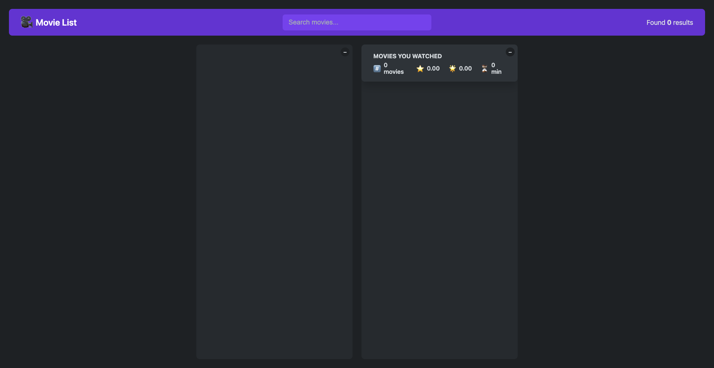
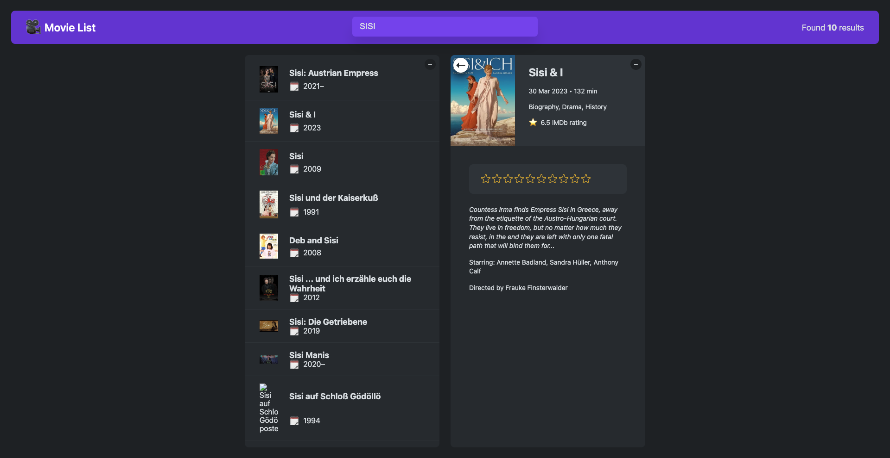
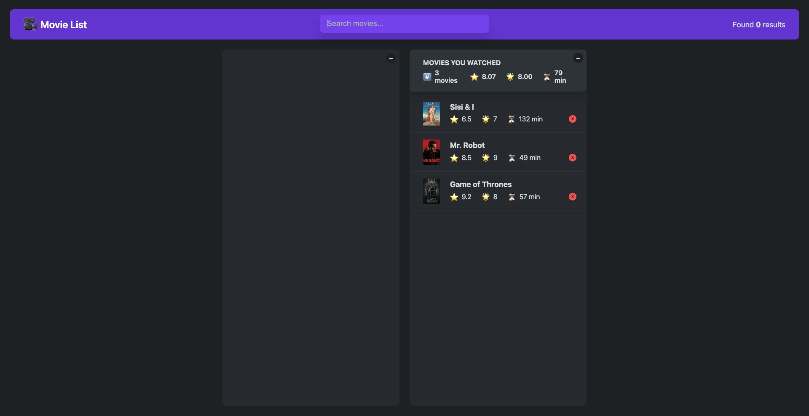

# Getting Started with Create React App

This project was bootstrapped with [Create React App](https://github.com/facebook/create-react-app).

## Available Scripts

In the project directory, you can run:

### `npm start`

Runs the app in the development mode.\
Open [http://localhost:3000](http://localhost:3000) to view it in your browser.

The page will reload when you make changes.\
You may also see any lint errors in the console.

### `npm test`

Launches the test runner in the interactive watch mode.\
See the section about [running tests](https://facebook.github.io/create-react-app/docs/running-tests) for more information.

### `npm run build`

Builds the app for production to the `build` folder.\
It correctly bundles React in production mode and optimizes the build for the best performance.

The build is minified and the filenames include the hashes.\
Your app is ready to be deployed!

See the section about [deployment](https://facebook.github.io/create-react-app/docs/deployment) for more information.

### `npm run eject`

**Note: this is a one-way operation. Once you `eject`, you can't go back!**

If you aren't satisfied with the build tool and configuration choices, you can `eject` at any time. This command will remove the single build dependency from your project.

Instead, it will copy all the configuration files and the transitive dependencies (webpack, Babel, ESLint, etc) right into your project so you have full control over them. All of the commands except `eject` will still work, but they will point to the copied scripts so you can tweak them. At this point you're on your own.

You don't have to ever use `eject`. The curated feature set is suitable for small and middle deployments, and you shouldn't feel obligated to use this feature. However we understand that this tool wouldn't be useful if you couldn't customize it when you are ready for it.

## Learn More

You can learn more in the [Create React App documentation](https://facebook.github.io/create-react-app/docs/getting-started).

To learn React, check out the [React documentation](https://reactjs.org/).

### Code Splitting

This section has moved here: [https://facebook.github.io/create-react-app/docs/code-splitting](https://facebook.github.io/create-react-app/docs/code-splitting)

### Analyzing the Bundle Size

This section has moved here: [https://facebook.github.io/create-react-app/docs/analyzing-the-bundle-size](https://facebook.github.io/create-react-app/docs/analyzing-the-bundle-size)

### Making a Progressive Web App

This section has moved here: [https://facebook.github.io/create-react-app/docs/making-a-progressive-web-app](https://facebook.github.io/create-react-app/docs/making-a-progressive-web-app)

### Advanced Configuration

This section has moved here: [https://facebook.github.io/create-react-app/docs/advanced-configuration](https://facebook.github.io/create-react-app/docs/advanced-configuration)

### Deployment

This section has moved here: [https://facebook.github.io/create-react-app/docs/deployment](https://facebook.github.io/create-react-app/docs/deployment)

### `npm run build` fails to minify

This section has moved here: [https://facebook.github.io/create-react-app/docs/troubleshooting#npm-run-build-fails-to-minify](https://facebook.github.io/create-react-app/docs/troubleshooting#npm-run-build-fails-to-minify)

# Meine Filmliste 🎬

## Description

_Meine Filmliste_ is a web application for movie enthusiasts who want to easily create, manage, and share their personal movie watchlists. The app allows users to keep track of the films they want to see, mark movies as watched, and discover new ones to add to their list.

Visit the live app: [meinefilmliste.netlify.app](https://meinefilmliste.netlify.app/)

---

## Features

- _Add movies to your watchlist_: Search for movies and add them to your list.
- _Mark movies as watched_: Track the films you’ve already seen.
- _Discover new films_: Get recommendations based on popular or trending movies.
- _Responsive design_: Fully functional across devices (desktop, tablet, and mobile).
- _Persistent storage_: Your watchlist is saved locally, so it persists even if you close the app.

---

## Table of Contents

- [Installation](#installation)
- [Usage](#usage)
- [Technologies](#technologies)
- [Contributing](#contributing)
- [License](#license)
- [Acknowledgements](#acknowledgements)
- [Screenshots](#screenshots)

---

## Installation

If you'd like to run this project locally, follow these steps:

1. _Clone the repository_:
   bash
   git clone [gh repo clone bryt11/The-Movie-List-Project](https://github.com/bryt11/The-Movie-List-Project.git)
   cd meinefilmliste

2. _Install dependencies_:
   This app is built using React, so make sure you have npm or yarn installed.

   bash
   npm install

   # or

   yarn install

3. _Start the development server_:
   bash
   npm start

   # or

   yarn start

4. _Open in your browser_:
   Visit http://localhost:3000 to view the app in development mode.

---

## Usage

1. _Browse or search for movies_: Use the search bar to find movies by title.
2. _Add movies to your list_: Click the "Add" button next to a movie to include it in your personal watchlist.
3. _Mark movies as watched_: Once you've watched a movie, click the "Watched" button to track your progress.
4. _View and manage your list_: Access your watchlist at any time to see movies you've added and manage their status.

---

## Technologies

- _Frontend_: [React](https://reactjs.org/)
- _CSS Framework_: [Vanilla CSS]()
- _Movie Data API_: [TMDb API](https://www.themoviedb.org/documentation/api) (The Movie Database)
- _Hosting_: [Netlify](https://www.netlify.com/)

---

## Contributing

Contributions are welcome! Follow the steps below to contribute to the project:

1. _Fork the repository_
2. _Create a new branch_ (git checkout -b feature-branch)
3. _Commit your changes_ (git commit -m 'Add a new feature')
4. _Push to the branch_ (git push origin feature-branch)
5. _Open a pull request_

Please make sure your code follows the project's coding standards and includes necessary tests.

---

## License

This project is licensed under the MIT License. See the [LICENSE](LICENSE) file for more details.

---

## Acknowledgements

- [The Open Movie Database (OMDb)](http://www.omdbapi.com/) for providing movie data via their API.
- [React](https://reactjs.org/)
- [Netlify](https://www.netlify.com/) for making the development and hosting of this project seamless.
- Inspired by movie watchlist apps, bringing movie lovers an easy way to track films.

---

## Screenshots

